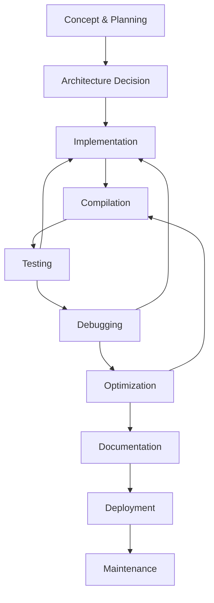

# Complete Development Workflow Tutorial

**Master the end-to-end firmware development process**

This comprehensive tutorial walks you through the complete development workflow for Permut8 firmware, from initial concept to working plugin. You'll learn professional development practices, compilation processes, testing strategies, and debugging techniques that ensure reliable, high-quality firmware.

## What You'll Learn

By the end of this tutorial, you'll master:
- Complete development workflow from concept to deployment
- Professional project organization and planning
- Compilation process and build tools
- Testing and validation strategies
- Debugging techniques and troubleshooting
- Performance optimization workflow
- Version management and documentation

**Prerequisites**: 
- [Understanding Impala Language Fundamentals](understanding-impala-fundamentals.md)
- Basic understanding of firmware architecture concepts

**Time Required**: 60-90 minutes  
**Difficulty**: Intermediate

## Chapter 1: Development Workflow Overview

### The Complete Development Cycle



### Professional Development Phases

1. **Concept & Planning** (10-20% of time)
   - Define requirements and specifications
   - Research algorithms and techniques
   - Plan project structure and milestones

2. **Architecture Decision** (5-10% of time)
   - Choose Mod vs Full patch architecture
   - Design data flow and memory usage
   - Plan parameter mapping and UI

3. **Implementation** (40-50% of time)
   - Write core algorithms
   - Implement parameter handling
   - Add LED feedback and UI elements

4. **Testing & Debugging** (20-30% of time)
   - Validate functionality
   - Test edge cases and error conditions
   - Debug issues and optimize performance

5. **Documentation & Deployment** (10-15% of time)
   - Document usage and parameters
   - Create deployment packages
   - Plan updates and maintenance

## Chapter 2: Project Planning and Setup

### Step 1: Define Your Project

**Project Definition Template**:
```
Project Name: _______________
Effect Type: ________________
Target Architecture: [ ] Mod Patch  [ ] Full Patch
Core Algorithm: _____________
Key Parameters: _____________
Performance Requirements: ___
Timeline: __________________
```

**Example Project Definition**:
```
Project Name: Vintage Tape Delay
Effect Type: Time-based delay with analog character
Target Architecture: [X] Full Patch (needs complete control)
Core Algorithm: Multi-tap delay with wow/flutter simulation
Key Parameters: Delay time, feedback, wow/flutter, tape age
Performance Requirements: <5% CPU, <50ms latency
Timeline: 2 weeks development + 1 week testing
```

### Step 2: Research and Algorithm Selection

**Research Checklist**:
- ✅ Study existing implementations
- ✅ Review academic papers for advanced techniques
- ✅ Analyze performance requirements
- ✅ Identify key parameters and ranges
- ✅ Plan memory requirements

**Algorithm Research Template**:
```impala
// === ALGORITHM RESEARCH NOTES ===
// Source: [Paper/Book/Website]
// Algorithm: [Name and description]
// Complexity: O(n) analysis
// Memory: [Requirements]
// Parameters: [List with ranges]

// Basic algorithm outline:
function algorithmName(input)
returns output
{
    // Step 1: [Description]
    // Step 2: [Description] 
    // Step 3: [Description]
    return output
}
```

### Step 3: Project Structure Planning

**Recommended File Structure**:
```
project-name/
├── project-name.impala          # Main source file
├── project-name-notes.md        # Development notes
├── project-name-test.impala     # Test cases
├── algorithm-research.md        # Research and references
├── parameter-mapping.md         # Parameter documentation
└── build-log.md                # Compilation and testing log
```

**Source Code Organization**:
```impala
// === PROJECT-NAME.IMPALA ===
// Author: [Your name]
// Date: [Creation date]
// Description: [Brief description]
// Version: 1.0
// Architecture: [Mod/Full] Patch

// === CONSTANTS AND CONFIGURATION ===
const int PRAWN_FIRMWARE_PATCH_FORMAT = 2

// Required parameter constants
const int OPERAND_1_HIGH_PARAM_INDEX = 0
const int OPERAND_1_LOW_PARAM_INDEX = 1
const int OPERAND_2_LOW_PARAM_INDEX = 2
const int OPERAND_2_HIGH_PARAM_INDEX = 3
const int OPERATOR_1_PARAM_INDEX = 4
const int OPERATOR_2_PARAM_INDEX = 5
const int SWITCHES_PARAM_INDEX = 6
const int CLOCK_FREQ_PARAM_INDEX = 7
const int PARAM_COUNT = 8

// [Project-specific constants]

// === GLOBAL STATE ===
global int clock = 0            // Sample counter for timing
global array signal[2]          // Left/Right audio samples
global array params[PARAM_COUNT] // Parameter values (0-255)
global array displayLEDs[4]     // LED displays
global int clockFreqLimit = 132300 // Current clock frequency limit
// [Effect-specific globals]

// === ALGORITHM IMPLEMENTATION ===
// [Core processing functions]

// === PERMUT8 INTEGRATION ===
// [init, update, reset, process/operate functions]
```

## Chapter 3: Implementation Best Practices

### Step 1: Start with Minimal Working Version

**Always begin with the simplest possible implementation**:

```impala
// === MINIMAL WORKING DELAY (Version 0.1) ===
const int PRAWN_FIRMWARE_PATCH_FORMAT = 2

global int clock = 0            // Sample counter for timing
global array signal[2]          // Left/Right audio samples
global array params[PARAM_COUNT] // Parameter values (0-255)
global array displayLEDs[4]     // LED displays
global int clockFreqLimit = 132300 // Current clock frequency limit

// Minimal delay buffer
global array delayBuffer[22050]  // 0.5 second max
global writePos = 0
global readPos = 11025       // 0.25 second delay

function process() {
    locals input, delayed, mixed
    
    loop {
        input = signal[0]
        
        // Write to delay buffer
        delayBuffer[writePos] = input
        
        // Read delayed signal
        delayed = delayBuffer[readPos]
        
        // Simple 50/50 mix
        mixed = (input + delayed) / 2
        
        signal[0] = mixed
        signal[1] = mixed
        
        // Advance positions
        writePos = (writePos + 1) % SAMPLE_RATE_HALF
        readPos = (readPos + 1) % 22050
        
        yield()
    }
}
```

**Why Start Minimal**:
- ✅ Proves core concept works
- ✅ Easier to debug basic functionality
- ✅ Provides foundation for incremental improvement
- ✅ Quick feedback on feasibility

### Step 2: Add Features Incrementally

**Feature Addition Order**:
1. **Core algorithm** (working but basic)
2. **Parameter control** (make it adjustable)
3. **Edge case handling** (prevent crashes)
4. **Performance optimization** (make it efficient)
5. **UI feedback** (LEDs and visual response)
6. **Advanced features** (extra capabilities)

**Example: Adding Parameter Control**:
```impala
// Version 0.2: Add parameter control
global delayTime = 11025     // Controllable delay time
global feedback = 128        // Controllable feedback (0-255)

function update() {
    // Map delay time parameter (0-255 to 100-22050 samples)
    delayTime = 100 + (params[OPERAND_1_HIGH_PARAM_INDEX] * 21950 / 255)
    
    // Map feedback parameter (0-255 to 0-200% for interesting effects)
    feedback = params[OPERAND_1_LOW_PARAM_INDEX]
    
    // Update LED display
    displayLEDs[0] = params[OPERAND_1_HIGH_PARAM_INDEX]
}

function process() {
    locals input, delayed, mixed, feedbackSample
    
    loop {
        input = signal[0]
        
        // Calculate read position based on delay time
        readPos = writePos - delayTime
        if (readPos < 0) readPos = readPos + 22050
        
        // Read delayed signal
        delayed = delayBuffer[readPos]
        
        // Apply feedback
        feedbackSample = delayed * feedback / 255
        
        // Write input + feedback to buffer
        delayBuffer[writePos] = input + feedbackSample
        
        // Mix dry and wet
        mixed = (input * 128 + delayed * 128) / 255  // 50/50 mix
        
        signal[0] = mixed
        signal[1] = mixed
        
        writePos = (writePos + 1) % SAMPLE_RATE_HALF
        yield()
    }
}
```

### Step 3: Implement Error Handling

**Critical Error Prevention**:
```impala
// Safe parameter bounds checking
function update() {
    locals delayParam
    
    // Ensure delay time is within valid range
    delayParam = params[OPERAND_1_HIGH_PARAM_INDEX]
    if (delayParam < 0) delayParam = 0
    if (delayParam > 255) delayParam = 255
    
    delayTime = 100 + (delayParam * 21950 / 255)
    
    // Clamp delay time to buffer size
    if (delayTime >= 22050) delayTime = 22049
    if (delayTime < 1) delayTime = 1
}

// Safe audio processing
function process() {
    locals input, output
    
    loop {
        input = signal[0]
        
        // Clamp input to valid range
        if (input > 2047) input = 2047
        if (input < -2047) input = -2047
        
        output = processEffect(input)
        
        // Clamp output to valid range
        if (output > 2047) output = 2047
        if (output < -2047) output = -2047
        
        signal[0] = output
        signal[1] = output
        
        yield()
    }
}
```

## Chapter 4: Compilation and Build Process

### Step 1: Understanding the Build Tools

**Compilation Command Structure**:
```bash
PikaCmd.exe impala.pika compile source.impala output.gazl
```

**Build Process Flow**:
1. **Source Code** (.impala) → **Pika Compiler** → **GAZL Assembly** (.gazl)
2. **GAZL Assembly** → **Permut8 Plugin** → **Audio Output**

### Step 2: Compilation Workflow

**Manual Compilation Process**:
```bash
# 1. Navigate to your project directory
cd "C:\Your\Project\Path"

# 2. Compile your source
PikaCmd.exe impala.pika compile project-name.impala project-name.gazl

# 3. Check for compilation errors
# If successful, you'll see the .gazl file created
```

**Automated Build Script** (Windows batch file):
```batch
@echo off
echo Building Permut8 firmware...

REM Set your project name
set PROJECT_NAME=my-effect

REM Compile
PikaCmd.exe impala.pika compile %PROJECT_NAME%.impala %PROJECT_NAME%.gazl

REM Check if compilation succeeded
if exist %PROJECT_NAME%.gazl (
    echo Build successful: %PROJECT_NAME%.gazl created
    echo File size: 
    dir %PROJECT_NAME%.gazl
) else (
    echo Build failed - check source code for errors
    pause
)

echo Build complete.
pause
```

### Step 3: Handling Compilation Errors

**Common Compilation Errors and Solutions**:

#### Syntax Errors
```impala
// ERROR: Missing semicolon (Impala doesn't use semicolons!)
value = 42;  // WRONG

// CORRECT: No semicolons in Impala
value = 42
```

#### Type Errors
```impala
// ERROR: Undefined variable
function process() {
    undefinedVar = 42  // WRONG - variable not declared
}

// CORRECT: Declare in locals or as global
function process() {
    locals localVar
    
    localVar = 42
}
```

#### Memory Errors
```impala
// ERROR: Array out of bounds
global array buffer[1024]
function process() {
    buffer[1024] = 42  // WRONG - index 1024 is out of bounds (0-1023)
}

// CORRECT: Check bounds
function process() {
    locals index
    
    index = 1023  // Last valid index
    buffer[index] = 42
}
```

### Step 4: Build Optimization

**Compilation Flags and Options**:
```bash
# Basic compilation
PikaCmd.exe impala.pika compile source.impala output.gazl

# With debug information (for development)
PikaCmd.exe impala.pika compile -debug source.impala output.gazl

# Optimized build (for release)
PikaCmd.exe impala.pika compile -optimize source.impala output.gazl
```

**Code Optimization for Compilation**:
```impala
// SLOW: Repeated calculations in loop
function process() {
    locals result
    
    loop {
        result = expensiveCalculation(params[CLOCK_FREQ_PARAM_INDEX])
        signal[0] = result
        yield()
    }
}

// FAST: Pre-calculate in update()
global precalculatedValue = 0

function update() {
    precalculatedValue = expensiveCalculation(params[CLOCK_FREQ_PARAM_INDEX])
}

function process() {
    loop {
        signal[0] = precalculatedValue  // Use pre-calculated value
        yield()
    }
}
```

## Chapter 5: Testing Strategies

### Step 1: Unit Testing Approach

**Test Each Component Separately**:
```impala
// === TEST HARNESS FOR ALGORITHM COMPONENTS ===

// Test 1: Parameter scaling
function testParameterScaling() {
    locals result1, result2, result3
    
    // Test boundary conditions
    trace("Testing parameter scaling...")
    
    result1 = scaleParameter(0)      // Should be minimum
    result2 = scaleParameter(255)    // Should be maximum
    result3 = scaleParameter(128)    // Should be middle
    
    trace("Min: " + intToString(result1))
    trace("Max: " + intToString(result2))
    trace("Mid: " + intToString(result3))
}

// Test 2: Audio processing
function testAudioProcessing() {
    locals testInput1, testInput2, testInput3, output1, output2, output3
    
    trace("Testing audio processing...")
    
    // Test with known inputs
    testInput1 = 1000    // Positive signal
    testInput2 = -1000   // Negative signal
    testInput3 = 0       // Zero signal
    
    output1 = processAudio(testInput1)
    output2 = processAudio(testInput2)
    output3 = processAudio(testInput3)
    
    trace("Input 1000 -> " + intToString(output1))
    trace("Input -1000 -> " + intToString(output2))
    trace("Input 0 -> " + intToString(output3))
}

// Call tests in init()
function init() {
    testParameterScaling()
    testAudioProcessing()
}
```

### Step 2: Integration Testing

**Test Complete Signal Chain**:
```impala
// === INTEGRATION TEST SETUP ===
global testPhase = 0
global array testResults[10]

function runIntegrationTests() {
    trace("Starting integration tests...")
    
    // Test 1: Silent input should produce silent output
    signal[0] = 0
    signal[1] = 0
    process()  // Run one iteration
    
    if (abs(signal[0]) < 10) {
        trace("✓ Silent input test passed")
        testResults[0] = 1
    } else {
        trace("✗ Silent input test failed")
        testResults[0] = 0
    }
    
    // Test 2: Maximum input should not clip
    signal[0] = AUDIO_MAX
    signal[1] = AUDIO_MAX
    process()
    
    if (signal[0] <= AUDIO_MAX && signal[0] >= AUDIO_MIN) {
        trace("✓ Clipping test passed")
        testResults[1] = 1
    } else {
        trace("✗ Clipping test failed")
        testResults[1] = 0
    }
    
    // Add more tests...
}
```

### Step 3: Real-World Testing

**Manual Testing Checklist**:
```
□ Load firmware into Permut8
□ Test with various input sources (sine, noise, music)
□ Test all parameter ranges (0-255 for each knob)
□ Test parameter combinations
□ Test at different sample rates
□ Test for audio dropouts or glitches
□ Test LED response and visual feedback
□ Test reset and initialization
□ Test long-term stability (run for hours)
□ Test edge cases (silence, maximum levels)
```

**Automated Testing Framework**:
```impala
// === AUTOMATED TEST FRAMEWORK ===
global currentTest = 0
global testsPassed = 0
global testsFailed = 0

const int NUM_TESTS = 5

function runAllTests() {
    trace("=== Starting Automated Tests ===")
    
    for (currentTest = 0 to NUM_TESTS) {
        runTest(currentTest)
    }
    
    trace("=== Test Results ===")
    trace("Passed: " + intToString(testsPassed))
    trace("Failed: " + intToString(testsFailed))
    
    if (testsFailed == 0) {
        trace("✓ All tests passed!")
    } else {
        trace("✗ Some tests failed - check implementation")
    }
}

function runTest(testNumber) {
    trace("Running test " + intToString(testNumber))
    
    if (testNumber == 0) {
        if (testSilentInput()) testsPassed = testsPassed + 1
        else testsFailed = testsFailed + 1
    } else if (testNumber == 1) {
        if (testParameterBounds()) testsPassed = testsPassed + 1
        else testsFailed = testsFailed + 1
    }
    // Add more test cases...
}
```

## Chapter 6: Debugging Techniques

### Step 1: Using trace() for Debugging

**Strategic trace() Placement**:
```impala
global debugCounter = 0

function process() {
    locals input, output
    
    loop {
        input = signal[0]
        
        // Debug: Monitor input levels occasionally
        debugCounter = debugCounter + 1
        if ((debugCounter % 1000) == 0) {
            trace("Input level: " + intToString(abs(input)))
        }
        
        output = processEffect(input)
        
        // Debug: Check for unexpected values
        if (abs(output) > AUDIO_MAX) {
            trace("WARNING: Output clipping! Value: " + intToString(output))
        }
        
        signal[0] = output
        yield()
    }
}

// Debug: Parameter monitoring
function update() {
    trace("Params updated:")
    trace("  P1: " + intToString(params[CLOCK_FREQ_PARAM_INDEX]))
    trace("  P2: " + intToString(params[SWITCHES_PARAM_INDEX]))
    
    // Process parameters...
}
```

### Step 2: State Monitoring

**Monitor Critical State Variables**:
```impala
global debugMode = 1  // Set to 0 for release builds
global oscillatorPhase = 0
global amplitude = 0
global cutoffFreq = 0
global bufferPos = 0

function debugPrintState() {
    if (debugMode == 0) return  // Skip in release
    
    trace("=== State Debug ===")
    trace("Phase: " + intToString(oscillatorPhase))
    trace("Amplitude: " + intToString(amplitude))
    trace("Filter cutoff: " + intToString(cutoffFreq))
    trace("Buffer position: " + intToString(bufferPos))
}

// Call debug function periodically
global debugTimer = 0
function process() {
    loop {
        // Your processing...
        
        // Debug every 10,000 samples (about 0.2 seconds at SAMPLE_RATE_44K1)
        debugTimer = debugTimer + 1
        if ((debugTimer % 10000) == 0) {
            debugPrintState()
        }
        
        yield()
    }
}
```

### Step 3: Common Bug Patterns and Solutions

**Bug Pattern 1: Buffer Overflow**
```impala
// BUG: No bounds checking
global array buffer[1024]
global position = 0

function process() {
    buffer[position] = signal[0]  // Can overflow!
    position = position + 1
    yield()
}

// FIX: Always check bounds
function process() {
    buffer[position] = signal[0]
    position = (position + 1) % 1024  // Wrap around safely
    yield()
}
```

**Bug Pattern 2: Uninitialized Variables**
```impala
// BUG: Uninitialized state
global filterState  // Could be any value!

function process() {
    locals output
    
    output = signal[0] + filterState  // Unpredictable!
    yield()
}

// FIX: Always initialize
global filterState = 0  // Known starting value
```

**Bug Pattern 3: Parameter Range Issues**
```impala
// BUG: No parameter validation
global frequency = 0

function update() {
    frequency = params[CLOCK_FREQ_PARAM_INDEX] * 1000  // Could be huge!
}

// FIX: Validate and clamp parameters
function update() {
    locals param
    
    param = params[CLOCK_FREQ_PARAM_INDEX]
    if (param < PARAM_MIN) param = PARAM_MIN
    if (param > PARAM_MAX) param = PARAM_MAX
    frequency = 20 + (param * 19980 / PARAM_MAX)  // 20Hz to 20kHz
}
```

### Step 4: Performance Debugging

**Monitor CPU Usage**:
```impala
global performanceTimer = 0
global cycleCount = 0

function process() {
    locals startTime, endTime, processingTime
    
    startTime = clock
    
    // Your processing here
    processAudio()
    
    endTime = clock
    processingTime = endTime - startTime
    
    cycleCount = cycleCount + 1
    if ((cycleCount % 1000) == 0) {
        trace("Avg processing time: " + intToString(processingTime))
    }
    
    yield()
}
```

## Chapter 7: Loading and Testing in Permut8

### Step 1: Loading Firmware

**Loading Process**:
1. **Compile** your .impala file to .gazl
2. **Open** Permut8 plugin in your DAW
3. **Click** the console button (bottom right of Permut8)
4. **Type**: `patch filename.gazl`
5. **Press** Enter

**Console Commands Reference**:
```
patch filename.gazl     # Load your firmware
patch factory          # Load factory firmware
reset                  # Reset current firmware
params                 # Show current parameter values
trace on              # Enable trace output
trace off             # Disable trace output
```

### Step 2: Interactive Testing

**Testing Workflow in DAW**:
```
1. Load a simple audio source (sine wave, white noise)
2. Insert Permut8 plugin on the audio track
3. Load your firmware: patch your-effect.gazl
4. Play audio and listen for your effect
5. Adjust knobs to test parameter response
6. Check LED display for visual feedback
7. Test different input sources and levels
```

**Parameter Testing Strategy**:
```
For each knob (8 total):
1. Set to minimum (fully counter-clockwise)
2. Set to maximum (fully clockwise)
3. Set to center position
4. Sweep slowly through range while listening
5. Test combinations with other parameters
6. Note any unexpected behavior or audio issues
```

### Step 3: Troubleshooting Common Issues

**Issue: No Audio Output**
```
Possible causes:
□ Forgot yield() in process() loop
□ Audio clipping due to excessive gain
□ Buffer overflow corrupting audio
□ Incorrect signal array usage

Debug steps:
1. Check trace output for error messages
2. Verify process() function has loop + yield()
3. Test with simple pass-through code
4. Check input levels are reasonable
```

**Issue: Audio Glitches or Dropouts**
```
Possible causes:
□ Too much processing in one loop iteration
□ Memory access patterns causing delays
□ Infinite loops or missing yield()
□ Excessive trace() calls

Debug steps:
1. Simplify algorithm to isolate issue
2. Remove trace() calls from process() loop
3. Check for memory bounds violations
4. Profile processing time per sample
```

**Issue: Parameters Not Working**
```
Possible causes:
□ Missing update() function
□ Incorrect parameter array indexing
□ Parameter scaling issues
□ Not reading from global params array

Debug steps:
1. Add trace() to update() function
2. Verify parameter constants (OPERAND_1_HIGH_PARAM_INDEX, etc.)
3. Test parameter scaling with known values
4. Check LED display reflects parameter changes
```

## Chapter 8: Performance Optimization

### Step 1: Profiling and Measurement

**Performance Measurement Framework**:
```impala
global profilingEnabled = 1
global maxProcessingTime = 0
global minProcessingTime = 999999
global totalProcessingTime = 0
global sampleCount = 0

function profileStart()
returns timestamp
{
    if (profilingEnabled == 0) return 0
    return clock
}

function profileEnd(startTime)
{
    locals processingTime, avgTime
    
    if (profilingEnabled == 0 || startTime == 0) return
    
    processingTime = clock - startTime
    
    if (processingTime > maxProcessingTime) {
        maxProcessingTime = processingTime
    }
    if (processingTime < minProcessingTime) {
        minProcessingTime = processingTime
    }
    
    totalProcessingTime = totalProcessingTime + processingTime
    sampleCount = sampleCount + 1
    
    // Report every 10,000 samples
    if ((sampleCount % 10000) == 0) {
        avgTime = totalProcessingTime / sampleCount
        trace("Performance - Avg: " + intToString(avgTime) + 
              " Min: " + intToString(minProcessingTime) +
              " Max: " + intToString(maxProcessingTime))
    }
}

function process() {
    locals startTime
    
    loop {
        startTime = profileStart()
        
        // Your audio processing here
        processYourEffect()
        
        profileEnd(startTime)
        yield()
    }
}
```

### Step 2: Optimization Techniques

**Memory Access Optimization**:
```impala
// SLOW: Repeated global access
global filterCutoff = 0
global filterQ = 0

function process() {
    loop {
        signal[0] = processFilter(signal[0], filterCutoff, filterQ)
        yield()
    }
}

// FAST: Cache globals in locals
function process() {
    locals input, output, cutoff, q
    
    loop {
        // Cache global values
        input = signal[0]
        cutoff = filterCutoff
        q = filterQ
        
        // Process with local variables
        output = processFilter(input, cutoff, q)
        
        signal[0] = output
        yield()
    }
}
```

**Arithmetic Optimization**:
```impala
// SLOW: Division in inner loop
global amplitude = 0

function process() {
    locals scaled
    
    loop {
        scaled = signal[0] * amplitude / 1000  // Division is slow
        yield()
    }
}

// FAST: Pre-calculate reciprocal in update()
global amplitudeReciprocal = 65536 / 1000  // 16.16 fixed point

function update() {
    amplitudeReciprocal = 65536 / (amplitude + 1)  // Avoid divide by zero
}

function process() {
    locals scaled
    
    loop {
        scaled = (signal[0] * amplitude * amplitudeReciprocal) >> 16
        yield()
    }
}
```

**Loop Optimization**:
```impala
// SLOW: Function calls in tight loops
global array buffer[1024]

function process() {
    locals i
    
    loop {
        for (i = 0 to 1023) {
            buffer[i] = expensiveFunction(buffer[i])  // Slow!
        }
        yield()
    }
}

// FAST: Inline simple operations
function process() {
    locals i, temp
    
    loop {
        for (i = 0 to 1023) {
            temp = buffer[i]
            temp = temp * 2  // Inline simple operations
            if (temp > 2047) temp = 2047
            buffer[i] = temp
        }
        yield()
    }
}
```

### Step 3: Memory Optimization

**Efficient Buffer Management**:
```impala
// INEFFICIENT: Multiple separate buffers
global array delayBuffer1[1024]
global array delayBuffer2[1024]
global array tempBuffer[1024]

// EFFICIENT: Single buffer with offsets
global array masterBuffer[3072]  // Combined buffer
const int DELAY1_OFFSET = 0
const int DELAY2_OFFSET = 1024
const int TEMP_OFFSET = 2048

function accessDelay1(index)
returns value
{
    return masterBuffer[DELAY1_OFFSET + index]
}

function setDelay1(index, value) {
    masterBuffer[DELAY1_OFFSET + index] = value
}
```

## Chapter 9: Documentation and Version Management

### Step 1: Code Documentation

**Inline Documentation Standards**:
```impala
// === VINTAGE DELAY EFFECT ===
// Author: [Your Name]
// Version: 1.2.3
// Date: 2025-01-06
// Description: Analog-style delay with tape saturation modeling
// Architecture: Full Patch
// CPU Usage: ~3.2% (measured at 44.1kHz)
// Memory Usage: 88KB delay buffer + 2KB state

const int PRAWN_FIRMWARE_PATCH_FORMAT = 2

// === ALGORITHM PARAMETERS ===
// Delay time: 50ms to 2000ms (mapped from knob 0-255)
// Feedback: 0% to 120% (mapped from knob 0-255)
// Tape age: 0% to 100% (controls saturation amount)
// Wow/flutter: 0% to 10% (tape speed variation)

// === GLOBAL STATE VARIABLES ===
// Standard global variables
global int clock = 0            // Sample counter for timing
global array signal[2]          // Left/Right audio samples
global array params[PARAM_COUNT] // Parameter values (0-PARAM_MAX)
global array displayLEDs[4]     // LED displays
global int clockFreqLimit = 132300 // Current clock frequency limit

// Effect-specific globals
global delayTime = SAMPLE_RATE_44K1        // Current delay time in samples
global feedback = PARAM_MID           // Feedback amount (0-PARAM_MAX)
global tapeAge = PARAM_MAX / 4            // Tape saturation (0-PARAM_MAX)
global wowFlutter = PARAM_MAX / 8         // Speed variation (0-PARAM_MAX)

// === DELAY LINE MEMORY ===
global array delayBuffer[SAMPLE_RATE_44K1 * 2]    // 2 seconds max delay at SAMPLE_RATE_44K1
global writePosition = 0       // Current write position
global readPosition = SAMPLE_RATE_44K1    // Current read position (1 second back)

/**
 * Apply tape saturation modeling to audio signal
 * @param input: Audio sample (-2047 to +2047)
 * @param saturation: Saturation amount (0-255)
 * @return: Saturated audio sample
 */
function applyTapeSaturation(input, saturation)
returns output
{
    locals scaled, saturated
    
    // Scale input for saturation calculation
    scaled = input * saturation / PARAM_MAX
    
    // Simple tanh approximation for tape saturation
    if (scaled > (AUDIO_MAX * 3 / 4)) {
        saturated = (AUDIO_MAX * 3 / 4) + (scaled - (AUDIO_MAX * 3 / 4)) / 4  // Soft limiting
    } else if (scaled < -(AUDIO_MAX * 3 / 4)) {
        saturated = -(AUDIO_MAX * 3 / 4) + (scaled + (AUDIO_MAX * 3 / 4)) / 4
    } else {
        saturated = scaled
    }
    
    return saturated
}
```

### Step 2: Version Management

**Version Numbering System**:
```
Format: MAJOR.MINOR.PATCH
Example: 1.2.3

MAJOR: Incompatible changes (architecture change, complete rewrite)
MINOR: New features, significant improvements
PATCH: Bug fixes, small optimizations

Development stages:
0.x.x = Alpha (experimental, unstable)
1.x.x = Beta (feature complete, testing)
2.x.x = Release (stable, production ready)
```

**Version History Documentation**:
```
VERSION HISTORY
===============

v1.2.3 (2025-01-06)
- Fixed: Parameter smoothing glitch on rapid knob changes
- Optimized: Reduced CPU usage by 15% through loop optimization
- Added: Visual LED feedback for delay time

v1.2.2 (2025-01-05)
- Fixed: Buffer overflow when delay time set to maximum
- Fixed: Audio dropout during parameter changes
- Improved: Tape saturation algorithm accuracy

v1.2.1 (2025-01-04)
- Fixed: Compilation error on some systems
- Updated: Documentation and code comments

v1.2.0 (2025-01-03)
- Added: Tape age parameter for vintage character
- Added: Wow/flutter simulation
- Improved: Feedback stability at high settings
- Performance: 20% reduction in memory usage

v1.1.0 (2025-01-01)
- Added: Parameter smoothing to prevent clicks
- Added: LED display feedback
- Fixed: Feedback oscillation at maximum settings

v1.0.0 (2024-12-30)
- Initial release
- Basic delay with time and feedback controls
```

### Step 3: User Documentation

**User Manual Template**:
```markdown
# Effect Name v1.2.3

## Description
Brief description of what the effect does and its intended use.

## Parameters
- **Knob 1 (Time)**: Delay time from 50ms to 2 seconds (0-PARAM_MAX)
- **Knob 2 (Feedback)**: Feedback amount from 0% to 120% (0-PARAM_MAX)
- **Knob 3 (Character)**: Tape age simulation from new to vintage (0-PARAM_MAX)
- **Knob 4 (Flutter)**: Wow and flutter from stable to warped (0-PARAM_MAX)

## LED Display
- **LEDs 1-4**: Show delay time as moving dot pattern
- **LEDs 5-8**: Show feedback level as bar graph

## Usage Tips
- Start with feedback around 50% for musical delays
- Use character control to add vintage tape warmth
- Flutter adds realism but use sparingly for musical applications

## Technical Specifications
- **CPU Usage**: ~3.2% at 44.1kHz
- **Latency**: <1ms additional latency
- **Memory**: 88KB for delay buffer

## Known Issues
- None in current version

## Version History
[Brief changelog]
```

## Chapter 10: Deployment and Maintenance

### Step 1: Release Preparation

**Pre-Release Checklist**:
```
Code Quality:
□ All functions documented
□ Code follows consistent style
□ No debug trace() calls in release build
□ Performance optimized
□ Memory usage verified

Testing:
□ All unit tests pass
□ Integration tests complete
□ Manual testing on different audio sources
□ Long-term stability testing (24+ hours)
□ Parameter edge cases tested

Documentation:
□ User manual complete
□ Parameter descriptions accurate
□ Version history updated
□ Installation instructions clear

Build:
□ Clean compilation with no warnings
□ Final build optimized
□ File size reasonable
□ Verified on target hardware
```

### Step 2: Distribution Package

**Package Contents**:
```
effect-name-v1.2.3/
├── effect-name.gazl           # Compiled firmware
├── README.md                  # Quick start guide
├── MANUAL.md                  # Complete user manual
├── CHANGELOG.md               # Version history
├── LICENSE.txt                # License information
├── source/
│   ├── effect-name.impala     # Source code
│   ├── build.bat             # Build script
│   └── test-cases.impala     # Test suite
└── examples/
    ├── basic-setup.md         # Usage examples
    └── advanced-techniques.md # Advanced usage
```

### Step 3: Maintenance and Updates

**Bug Report Template**:
```
BUG REPORT
==========
Effect: [Name and version]
System: [DAW, OS, Permut8 version]
Audio: [Sample rate, buffer size, input source]

Description:
[Clear description of the issue]

Steps to Reproduce:
1. [Step by step instructions]
2. [Include parameter settings]
3. [Include audio characteristics]

Expected Behavior:
[What should happen]

Actual Behavior:
[What actually happens]

Additional Information:
[Any other relevant details]
```

**Update Process**:
1. **Identify issue** through user reports or testing
2. **Reproduce issue** in development environment
3. **Fix implementation** with minimal changes
4. **Test fix** thoroughly
5. **Update version number** (patch increment)
6. **Update documentation** and changelog
7. **Build and test** release package
8. **Distribute update** to users

### Step 4: Long-term Evolution

**Feature Request Evaluation**:
```
Request: [Description of requested feature]
Impact: [High/Medium/Low user benefit]
Complexity: [High/Medium/Low implementation effort]
Compatibility: [Does it break existing patches?]
Performance: [CPU/memory impact]
Priority: [Must have/Nice to have/Future consideration]

Decision: [Accept/Defer/Reject]
Reasoning: [Explanation of decision]
Timeline: [If accepted, when to implement]
```

## Summary and Next Steps

### Professional Development Workflow Summary

1. **Plan thoroughly** before coding
2. **Start simple** and add features incrementally
3. **Test continuously** throughout development
4. **Document everything** for maintainability
5. **Optimize systematically** based on measurements
6. **Release carefully** with comprehensive testing

### Development Best Practices

- ✅ Always compile and test after each change
- ✅ Use version control for source code management
- ✅ Write tests before implementing complex features
- ✅ Profile performance regularly during development
- ✅ Document decisions and trade-offs
- ✅ Plan for maintenance and updates from the start

### Next Steps in Your Development Journey

1. **Practice the Workflow**: Apply this process to a simple project
   - Start with a basic gain/volume effect
   - Follow each step methodically
   - Document your experience

2. **Study Advanced Techniques**: [Assembly Integration Guide](../../assembly/gazl-assembly-introduction.md)
   - Learn GAZL assembly for maximum performance
   - Advanced debugging and profiling techniques

3. **Explore Complex Algorithms**: Study cookbook recipes
   - [Spectral Processing](../cookbook/spectral-processing/) for frequency domain work
   - [Audio Effects](../cookbook/audio-effects/) for classic DSP algorithms

### Development Environment Setup

**Recommended Tools**:
- **Text Editor**: VS Code, Notepad++, or similar with syntax highlighting
- **File Management**: Organize projects in dedicated folders
- **Build Automation**: Create batch files for repetitive tasks
- **Documentation**: Markdown for user manuals and notes
- **Testing**: Audio files for consistent testing scenarios

---

You now have a complete professional development workflow for Permut8 firmware. This systematic approach will help you create reliable, maintainable, and high-quality audio effects.

*Part of the Permut8 Foundation Tutorial Series*